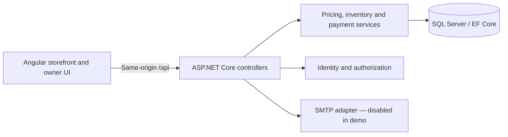

# SO

A website for a small scarf boutique, with a Hebrew storefront and a dashboard for managing products, stock and orders.

Built with **Angular 22, ASP.NET Core 8, Entity Framework Core and SQL Server**. Customers can browse the collection, choose a color, place an order and follow its progress. The store owner manages the catalog and confirms payments from a separate dashboard.

This is the public portfolio version of the project. Contact details, payment recipients and stock quantities have been replaced with examples. It includes the application code and tests, but no customer database or production credentials. This copy is for local demonstration, not real purchases.

## Features

| Area | Features |
| --- | --- |
| Storefront | Catalog, collections, search suggestions, favorites, product variants and image zoom |
| Checkout | Guest and account orders, coupons, delivery or pickup, server-calculated prices |
| Inventory | Reservations at order creation, expiry, cancellation and concurrent last-item protection |
| Payments | Manual transfer declaration and separate owner approval; duplicate approval protection |
| Customer accounts | Registration, login, password reset and order history |
| Owner dashboard | Products, stock, coupons, customers, orders, fulfillment and basic sales reports |
| Security | Owner MFA, recovery codes, cookie authentication, CSRF protection and rate limits |

## Architecture



- `so/src/app/`: Angular pages, services, catalog and owner UI.
- `so.api/Controllers/`: HTTP endpoints and request authorization.
- `so.api/Payments/`: stock reservations and payment state transitions.
- `so.api/Security/`: authentication, validation, pricing and email delivery.
- `so.api/Models/`, `Data/`, `Migrations/`: relational model and schema evolution.
- `tests/`: isolated SQL and HTTP integration checks.

## How orders work

Items are reserved when an order is placed, for 30 minutes by default. Adding something to the cart does not reserve it. The server checks stock within a database transaction so that two customers cannot both reserve the last item. If a reservation expires, the items become available again.

The store uses manual transfers. Customers can mark a transfer as sent; the owner checks that it arrived before approving the order. Approval rechecks stock and prevents a repeated confirmation from deducting the same items twice. There is no card checkout.

Prices, coupons and delivery fees are calculated again on the server when an order is placed. The checkout total shown in the browser is not used as the final price.

Orders have random reference codes. Knowing a code alone does not grant access to the order: customers need their account or the protected cookie issued for a guest order.

## Run locally

Prerequisites: Node.js compatible with the Angular version in `so/package.json`, npm, .NET 8 SDK, and SQL Server. The example below uses Windows SQL Server LocalDB. Use a dedicated, disposable database for this portfolio.

1. Copy `so.api/appsettings.Example.json` to `so.api/appsettings.Development.json`. Adjust the local SQL connection if needed. The destination is ignored by Git. Mail remains disabled.
2. In `so.api`, install EF tooling if needed, then apply migrations and run the API:

   ```sh
   dotnet tool install --global dotnet-ef --version 8.0.26
   dotnet ef database update
   dotnet run --launch-profile http
   ```

3. In a second terminal:

   ```sh
   cd so
   npm ci
   npm start
   ```

4. Open `http://localhost:4200`. Angular proxies API and product asset requests to port 5179.

To configure your own local owner credentials on Windows, run `configure-admin.cmd` from the repository root, then restart the API. The tool stores a password hash in this portfolio's separate .NET User Secrets store. There is no shared default administrator password. Complete authenticator enrollment at `/admin/login`.

The historical catalog import is a guarded, one-time migration tool for the original eight-product seed. Review `Data/CatalogImport.cs` before using it; it is not a generic import command. Products can also be added through the owner UI.

## Tests and builds

```sh
# From so/
npm test -- --watch=false
npm run build

# From so.api/
dotnet build -c Release

# From the repository root, after configuring a local SQL connection
node tests/run-commerce.cjs
```

Integration fixtures create uniquely named temporary databases and remove them afterwards. The SQL login needs permission to create and drop those test databases. The test runner disables external email; SMTP assertions use a local test server. Some older standalone test scripts are historical helpers; `run-commerce.cjs` is the maintained integration entry point.

## Current status

The project runs locally; public hosting has not been set up yet. Before launch, the remaining work includes backups and restore testing, checking the deployed site, a full manual accessibility review and finalizing the store policies.

Email delivery has no persistent retry queue, and owner sessions currently support one API instance. SMS and automatic payment processing are not connected. See [SECURITY.md](SECURITY.md) for the security controls and checks.

This repository starts from the public portfolio version; earlier private commits are not included. AI coding tools were used during development.

The store's photos and branding belong to their respective owners. This repository does not grant a license to reuse them or the code.
