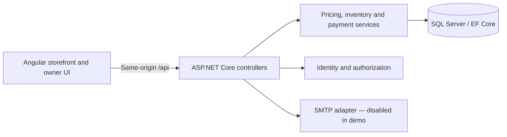

# SO — Boutique Ecommerce

A Hebrew, right-to-left storefront and owner dashboard built with **Angular 22, ASP.NET Core 8, Entity Framework Core and SQL Server**.

This is a sanitized snapshot of an actual boutique store project, published for code review and portfolio presentation. It retains the application logic and tests while replacing store contact and payment details. It is not a live shop: do not transfer money using this copy. Product quantities in the bundled catalog are demonstration values.

## What to explore

| Area | Implemented behavior |
| --- | --- |
| Storefront | Catalog, collections, search suggestions, favorites, product variants and image zoom |
| Checkout | Guest and account orders, coupons, delivery or pickup, server-calculated prices |
| Inventory | Reservations at order creation, expiry, cancellation and concurrent last-item protection |
| Payments | Manual transfer declaration and separate owner approval; duplicate approval protection |
| Customer accounts | Registration, login, password reset and order history |
| Owner dashboard | Products, stock, coupons, customers, orders, fulfillment and basic sales reports |
| Security | Owner MFA, recovery codes, cookie authentication, CSRF protection and rate limits |

## Architecture



- `so/src/app/`: Angular pages, services, catalog and owner UI.
- `so.api/Controllers/`: HTTP endpoints and request authorization.
- `so.api/Payments/`: stock reservations and payment state transitions.
- `so.api/Security/`: authentication, validation, pricing and email delivery.
- `so.api/Models/`, `Data/`, `Migrations/`: relational model and schema evolution.
- `tests/`: isolated SQL and HTTP integration checks.

## Design decisions

**An open cart does not reserve stock.** An order holds stock for a configurable duration (30 minutes by default). Atomic server-side checks prevent two orders from reserving the last unit. Expired holds stop blocking availability, and late manual approval rechecks inventory.

**A payment declaration is not proof of payment.** The shopper can report a transfer, but only an authorized owner can confirm receipt. Approval cannot deduct inventory twice. A future provider integration can reuse the payment workflow, but a real automatic payment provider is not connected.

**The server owns the price.** Product prices, discounts and delivery eligibility are recalculated server-side. Client totals are not authoritative.

**Public order codes are not access credentials.** Random codes avoid exposing the order sequence. Reading an order still requires an authorized account or protected guest access.

## Run locally

Prerequisites: Node.js compatible with the Angular version in `so/package.json`, npm, .NET 8 SDK, and SQL Server. The example below uses Windows SQL Server LocalDB. Use a dedicated, disposable database for this portfolio.

1. Copy `so.api/appsettings.Example.json` to `so.api/appsettings.Development.json`. Adjust the local SQL connection if needed. The destination is ignored by Git. Mail remains disabled.
2. In `so.api`, install EF tooling if needed, then apply migrations and run the API:

   ```sh
   dotnet tool install --global dotnet-ef --version 8.0.26
   dotnet ef database update
   dotnet run --launch-profile http
   ```

3. In a second terminal:

   ```sh
   cd so
   npm ci
   npm start
   ```

4. Open `http://localhost:4200`. Angular proxies API and product asset requests to port 5179.

To configure your own local owner credentials on Windows, run `configure-admin.cmd` from the repository root, then restart the API. The tool stores a password hash in this portfolio's separate .NET User Secrets store. There is no shared default administrator password. Complete authenticator enrollment at `/admin/login`.

The historical catalog import is a guarded, one-time migration tool for the original eight-product seed. Review `Data/CatalogImport.cs` before using it; it is not a generic import command. Products can also be added through the owner UI.

## Tests and builds

```sh
# From so/
npm test -- --watch=false
npm run build

# From so.api/
dotnet build -c Release

# From the repository root, after configuring a local SQL connection
node tests/run-commerce.cjs
```

Integration fixtures create uniquely named temporary databases and remove them afterwards. The SQL login needs permission to create and drop those test databases. The test runner disables external email; SMTP assertions use a local test server. Some older standalone test scripts are historical helpers; `run-commerce.cjs` is the maintained integration entry point.

## Scope and remaining work

This is a work in progress, not a production-readiness certification. Public hosting, production backup/restore, deployment verification, comprehensive manual accessibility testing and final business policies remain deployment tasks. SMTP delivery currently logs failures but does not have a durable retry queue. Owner sessions assume a single API instance. SMS and automatic payment processing are not connected.

The repository is an intentionally new public snapshot, not the complete private development history. Development was assisted by AI coding tools. The source and tests are provided so reviewers can examine the implementation directly.

No open-source license is granted by this snapshot. Store photography and branding remain subject to their owners' rights.
